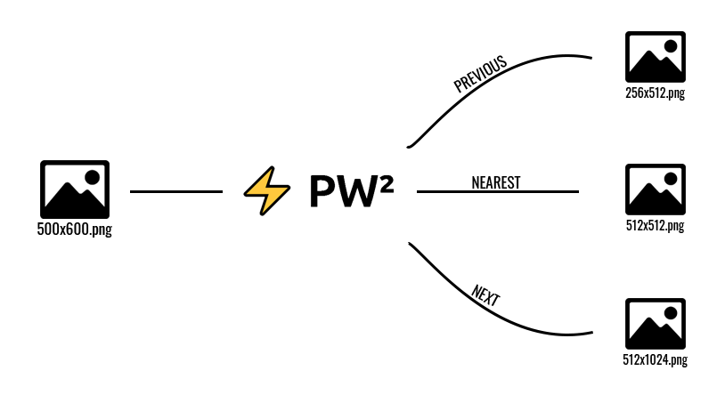

# ⚡ PW² - React

  

A ReactJS Application that easily allows you to re-scale your images to the right power of two dimensions.

## Usage

- Access the [Live Website.](https://pw2-react.vercel.app/)
- Drag and drop your images.
- Choose a Resizing Mode.
- Download the images individually or all at once in a .zip file.

## But Why ?

Games and real-time applications, in general, tend to prefer images and textures with power-of-two dimensions, because they make it easier to generate mipmaps, consume less GPU memory, and increase the overall performance for shader operations.

However, finding the right power-of-two values for each dimension of each texture of each model in your application sounds time-consuming, and it is. [⚡PW²](https://www.npmjs.com/package/pw2) born from the necessity to make this a no-brainer, quick and easy process.

This application was developed for the cs50 Final Project assignment and as a use case of [⚡PW²](https://www.npmjs.com/package/pw2) library.

## License

[MIT](https://github.com/jordyhenry/pw2-react/blob/master/LICENSE)

## TODO
- Update pw2 and refactor for compatibility
- Remove Buffer casting on LandingPage readFile function on [./src/pages/LandingPage/index.ts](https://github.com/jordyhenry/pw2-react/blob/master/src/pages/LandingPage/index.tsx#L187) (this item depends directly from the pw2 update)
- Add [pw2-cli](https://www.npmjs.com/package/pw2-cli) link to [./src/utils/RelatedLinks.ts](https://github.com/jordyhenry/pw2-react/blob/master/src/utils/RelatedLinks.ts)
- Add snack message for rejected files due to limitations on [./src/utils/UploadConfiguration.ts](https://github.com/jordyhenry/pw2-react/blob/master/src/utils/UploadConfiguration.ts)
- Fix any English misspells (sorry guys, it's not my first language  🤷‍♂️ )